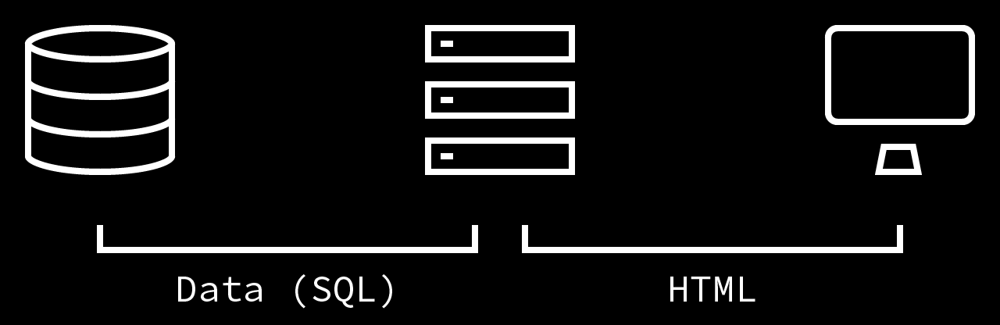
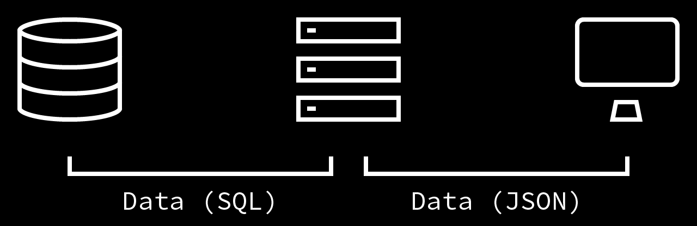

build-lists: true
autoscale: true


- `git clone https://github.com/iverds/booster2019-graphql`
- `npm install`
- `npm start`

---

## Getting started with GraphQL

### Iver Skjervum-Karlsen

---


---

# Motivation

- Reflect on how you fetch data from a client
- Try out GraphQL
- Make you curious

---

# Agenda

1. Introduction
2. GraphQL. What is it?
3. Queries
4. Mutations
5. Subscriptions

---

# Introduction

---

# When we fetched HTML



---
# Single Page Applications (SPA)



---

# Challenges with REST

- Hard to do correctly (for me at least)
- Often ends up with REST-ish endpoints
- Underfetching and Overfetching

---

# Case: Sports application

- Clubs
- Players
- Fixtures
- Goals

---

# Two pages:

- One with one club, list of players and last five fixtures
- One with all the clubs, and their last match

---

# With REST

- `/clubs`
- `/clubs/{id}`
- `/clubs/{id}/players`
- `/clubs/{id}/season_fixtures`

---

# `/clubs`

```javascript
[
    {
        id: 1,
        name: "Arsenal",
        club_code: "ARS",
        stadium: "Emirates Stadium",
        capacity: 59867,
        manager: "Unai Emery",
        manager_nationality: "Spain",
        position: 5,
        players: { href: "/api/clubs/1/players" },
        season_fixtures: { href: "/api/clubs/1/fixtures" }
    },
    {
        id: 2,
        name: "Bournemouth",
        club_code: "BOU",
        stadium: "Vitality Stadium",
        capacity: 11360,
        manager: "Eddie Howe",
        manager_nationality: "England",
        position: 12,
        players: { href: "/api/clubs/2/players" },
        season_fixtures: { href: "/api/clubs/2/fixtures" }
    },
]
```

---

# REST(ish)

- `/GetClubWithPlayersAndFixturesById`
- `/GetClubsWithFixtures`
- `/GetClubsWithLastMatch`

---

## Underfetching
- An endpoint doesn't provide enough information
- N+1 problem

## Overfetching
- We get a lot of data that we don't need

---

# GraphQL. What is it?

---

# GraphQL. What is it?

- It lets us specify the the data we need in a query
- Easy to write correctly
- Schema and typing
- No silver bullet

---

# Demo

---

# How it works

- Operations
- Schema
- Resolvers

---

# Operations

- `query`: Query for data
- `mutation`: Create or update and then return some data
- `subscription`: Subscribe on data changes

---


# Query and response

[.code-highlight: none]
[.code-highlight: 1-5]
[.code-highlight: 7-11]
```javascript
fetch('graphql', {
  method: 'POST',
  headers: { 'Content-Type': 'application/json' },
  body: JSON.stringify({ query: '{ hello }' }),
})

{
    "data": {
        "hello": "Hello World!"
    }
}
```

---

# Schema

[.code-highlight: none]
[.code-highlight: 2]
[.code-highlight: 3]
[.code-highlight: 4]
[.code-highlight: 5]
[.code-highlight: 6]

```javascript
type Query {
    id: ID
    hello: String!
    number: Int
    float: Float
    isTrue: Boolean
}
```

---

# Resolver

[.code-highlight: none]
[.code-highlight: 3]
[.code-highlight: 4]
[.code-highlight: 5]
[.code-highlight: 6]
[.code-highlight: 7]
```javascript
const resolvers = {
    Query: {
        id: (parent, args, context, info) => 1,
        hello: () => 'Hello World!',
        number: () => 12345,
        float: () => 123.45,
        isTrue: () => true
    }
}
```

---

# Resolver

```javascript
id: (parent, args, context, info) => 1,
```
- `parent`: The parent object (often not used on root query)
- `args`: Input arguments to the graphql query/mutation
- `context`: Request-spesific information like current user and database connection
- `info`:  Field-specific information

---

# Complete example

[.code-highlight: none]
[.code-highlight: 1]
[.code-highlight: 3-6]
[.code-highlight: 8-12]
[.code-highlight: 14-15]
[.code-highlight: all]
```javascript

const { GraphQLServer } = require('graphql-yoga')

const typeDefs = `
type Query {
  hello: String!
}`

const resolvers = {
  Query: {
    hello: (parent, args, context, info) => 'Hello World!'
  }
}

const server = new GraphQLServer({ typeDefs, resolvers })
server.start(() => console.log('Server is running on localhost:4000'))

```
---

# Task 1 - A simple query

Create a simple query that returns one or more of the built in scalars

- `git clone https://github.com/iverds/booster2019-graphql`
- `npm install`
- `npm start`
- `src/task1/task1.graphql`: Schema
- `src/task1/task1.js`: Resolver

---

# Custom types

---

# Custom types

[.code-highlight: none]
[.code-highlight: 1]
[.code-highlight: 2]
[.code-highlight: 3]
[.code-highlight: 4]
[.code-highlight: 5]
[.code-highlight: all]
```javascript
type Human {
    id: ID!
    first_name: String!
    last_name: String!
    age: Int!
}
```

---

# Parameters

---

# Parameters

[.code-highlight: none]
[.code-highlight: 1-3]
[.code-highlight: 5-11]
[.code-highlight: all]

```javascript 
type Query {
    human(id: ID!): Human
}

const resolvers = {
    Query: {
        human = (parent, args, context, info) => {
            console.log("Id: ", args.id);
        }
    }
}
```

---

# Parameters

[.code-highlight: none]
[.code-highlight: 1-4]
[.code-highlight: 6-8]
[.code-highlight: 10-16]
[.code-highlight: all]
```javascript
input HumanSearch {
    name: String
    hometown: String
}

type Query {
    searchHuman(search: HumanSearch!): Human
}

const resolvers = {
    Query: {
        searchHuman = (parent, args, context, info) => {
            console.log("Search: ", args.search.name);
        }
    }
}
```

---

# Task 2 - Parameterized queries

1. Create a query that return a club by name
2. Create a query that returns a club based on a Search input type

- Get data from `data.js` (Thanks to https://github.com/drraq)
- `const { clubs } = require('./data')` 
- Remember to change reference in `server.js`

---

# Lists

---

# Lists

```json
type Query {
    humans: [Human!]!
}
```

---

# Nested queries

---

# Nested queries

[.code-highlight: none]
[.code-highlight: 1-5]
[.code-highlight: 8-10]
[.code-highlight: 11-13]
[.code-highlight: all]
```javascript
type Human {
    name: String
    hometown: String
    friends: [Human]
}

const resolvers = {
    Query: {
        humans: (parent, args) => {...}
    },
    Human: {
        friends: (parent, args) => {...}
    }
}
```

---

# Task 3 - Nested queries

1. Create a query that returns a list of clubs, and include the last given number of fixtures
2. Include all goal scorers for a fixture
3. Include all players for a club

---

# Mutations

---

# Mutations

[.code-highlight: none]
[.code-highlight: 1-3]
[.code-highlight: 5-11]
[.code-highlight: all]
```javascript
type Mutation {
    createHuman(first_name: String, last_name: String, age: Int): Human
}

const resolvers = {
    Mutation: {
        createHuman: (parent, args) => {
            //Create human and return it
        }
    }
}
```

---

# Task 4 - Mutations

1. Create a mutation that creates a goal for a fixture and returns it

---

# Subscriptions

---

# Subscriptions

```json
type Subscription {
    humanBorn: Human
}
```

---

# Subscriptions

[.code-highlight: none]
[.code-highlight: 1-2]
[.code-highlight: 5-10]
[.code-highlight: 11-15]
[.code-highlight: 17-18]
[.code-highlight: all]
```javascript
const { GraphQLServer, PubSub } = require('graphql-yoga')
const CHAT_CHANNEL = 'CHANNEL';

const resolvers = {
    Mutation: {
        createHuman: (parent, args) => {
            // Create human
            pubsub.publish(CHAT_CHANNEL, { humanBorn: {} })
        }
    },
    Subscription: {
        messageSent: {
            subscribe: (root, args, { pubsub }) => pubsub.asyncIterator(CHAT_CHANNEL)
        }
    }
}

const pubsub = new PubSub()
const server = new GraphQLServer({ typeDefs, resolvers, context: { pubsub } })
```

---

# Task 5

Create a subscription that subscribes to new goals

---

# GraphQL bottlenecks

---

# GraphQL bottlenecks

```javascript
query {
    humans {
        name
        friends {
            name
        }
    }
}
```

- N+1 SQL (or other data) queries
- Multiple queries for same resource

---

# Dataloader

- Batches up multiple requests, and execute as one request
- Caches data during the lifetime of a request
- Based on one function that take an array of keys
- The Array of values returned must be the same length as the Array of keys.
- Each index in the Array of values must correspond to the same index in the Array of keys.

---

```javascript
const getFriendsByUserIds = userIds => {
    return Promise.resolve(userIds.map(k => k + 1))
}
```

---

# Dataloader

[.code-highlight: none]
[.code-highlight: 9-17]
[.code-highlight: 10-16]
[.code-highlight: 4-6]
```javascript
var DataLoader = require('dataloader')

const resolver = {
    Human: {
        friends = (parent, args, context) => context.friendsLoder.load(club.id)
    }
}

const server = new GraphQLServer({ typeDefs: './src/task6/task6.graphql', resolvers,
    context: () => { 
        return { 
            loaders: {
                friendsLoder: new DataLoader(getFriendsByUserIds);
            }
        } 
    }
})
```

---

# Task 6 - Dataloader

1. Change calls for nested resources to use dataloader

---

# Pitfalls

---
# Endless quieries

```javascript
query {
    humans {
        name
        friends {
            name
            friends {
                name
                friends { name friends { friends { friends { }}}}
            }
        }
    }
}
```

---

# Authorization

- Common vulnerability in graphql-endpoints
- The `context` parameter is a perfect place for resolving user information
- Think of authorization in every resolver

---

# Authorization

[.code-highlight: none]
[.code-highlight: 3-7]
[.code-highlight: 4]
[.code-highlight: 5-6]
```javascript
const resolvers = {
    Human: {
        friends: (parent, args, context) => {
            const currentUser = getUser(context.user_id);
            return getFriendsForUser(parent.user_id)
                .filter(user => currentUser.friends.some(f => f.user_id === user.user_id))
        }
    }
}
```

---

# Task 7 - Authorization

1. Create a method `getUser` that return a user, which have a list of club-ids
2. Set a static user id on the context
3. Change the club resolver to only return clubs the user have access to

```javascript
{
    name: 'Trener Trenersen',
    club_ids: [1, 2, 3]
}
```

---

# Resources

- https://github.com/iverds/booster2019-graphql
- https://graphql.org/
- https://www.howtographql.com/
- https://github.com/prisma/graphql-yoga
- https://github.com/facebook/dataloader


---

# Thank you
